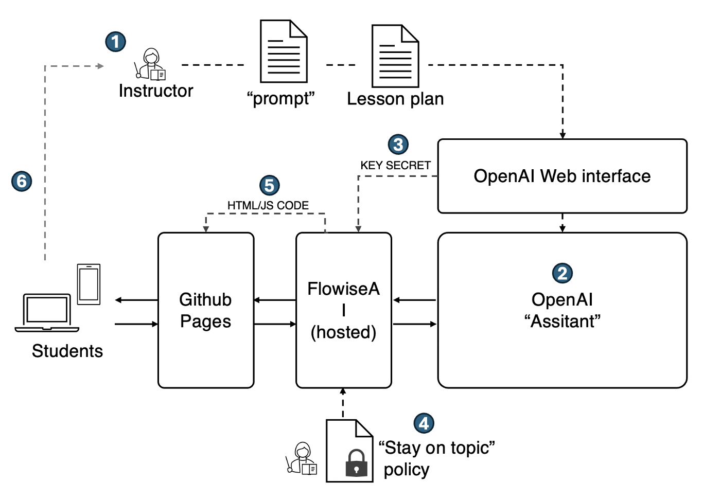

# OS315 chatbot

## Q1	
- GTP: 	https://chat.openai.com/g/g-NRNKFMJR4-os315
- Prompt: see Fig 1
- Lesson plan: basic unix commands cd, ls,  (OS_lab23.txt)
- Dates: Feb 2-5

## Q2
- GTP:
- urlb https://chat.openai.com/g/g-tWCOReUO6-os315q2plain
- urlb https://chat.openai.com/g/g-yKTJKRyDZ-os315q2emoji
- Lesson plan: redirect, wc, grep (OS_lab45.txt)
- Dates: Feb 5-8

## Q3	
- Lesson plan: practice scripting, nano, chmod (OS_lab6.txt)
- Dates: Feb 10-14

## cs50ai	
- Url: https://cs50.ai/chat
- Prompt: N/A
- Lesson plan: Q&A style chatbot for CS50 [cs50]
- Dates: Feb 16-20
